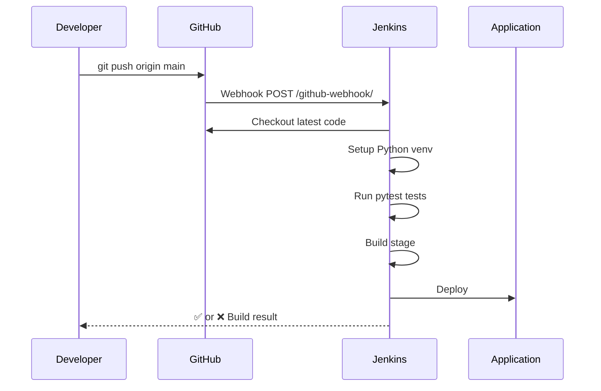

# 🚀 Jenkins CI/CD Pipeline — Complete Step-by-Step Guide

> Trigger a Jenkins pipeline automatically on every `git push`

---

## 📁 Project Structure Created

```
d:\project\jenkins_first\
├── app.py               ← Your Flask application
├── requirements.txt     ← Python dependencies
├── Jenkinsfile          ← Pipeline definition (Jenkins reads this)
├── .gitignore           ← Excludes venv, __pycache__, etc.
└── tests\
    └── test_app.py      ← Unit tests run in the pipeline
```

---

## PART 1 — Push Your Code to GitHub

### Step 1: Create a GitHub Repository

1. Go to [https://github.com](https://github.com) → **New Repository**
2. Name it: `jenkins_first`
3. Set it to **Public** (easier for webhooks) or Private
4. **Do NOT** initialize with README (your code is local)
5. Click **Create Repository**

---

### Step 2: Initialize Git and Push

Run these commands in PowerShell inside `d:\project\jenkins_first\`:

```powershell
# Navigate to your project
cd d:\project\jenkins_first

# Initialize git
git init

# Add all files
git add .

# First commit
git commit -m "Initial commit: Flask app + Jenkinsfile"

# Add GitHub remote (replace YOUR_USERNAME with your GitHub username)
git remote add origin https://github.com/YOUR_USERNAME/jenkins_first.git

# Push to GitHub
git branch -M main
git push -u origin main
```

> [!TIP]
> After this, every future change just needs: `git add . → git commit -m "msg" → git push`

---

## PART 2 — Configure Jenkins

### Step 3: Install Required Jenkins Plugins

1. Open Jenkins → **Manage Jenkins** → **Plugins** → **Available Plugins**
2. Search and install these plugins:
   - ✅ **Git Plugin**
   - ✅ **GitHub Plugin**
   - ✅ **Pipeline**
   - ✅ **GitHub Integration Plugin** (for webhooks)
3. Click **Install** → Restart Jenkins after install

---

### Step 4: Create a New Jenkins Pipeline Job

1. From Jenkins Dashboard → click **New Item**
2. Enter name: `jenkins_first_pipeline`
3. Select **Pipeline** → click **OK**

---

### Step 5: Configure the Pipeline Job

Inside the job configuration page:

#### ➤ General Section
- ✅ Check **"GitHub project"**
- **Project URL**: `https://github.com/YOUR_USERNAME/jenkins_first/`

#### ➤ Build Triggers Section
- ✅ Check **"GitHub hook trigger for GITScm polling"**
  - This tells Jenkins to listen for GitHub webhook events

#### ➤ Pipeline Section
- **Definition**: Select `Pipeline script from SCM`
- **SCM**: Select `Git`
- **Repository URL**: `https://github.com/YOUR_USERNAME/jenkins_first.git`
- **Credentials**: Add your GitHub credentials (see Step 6)
- **Branch Specifier**: `*/main`
- **Script Path**: `Jenkinsfile` ← Jenkins will find this file automatically

Click **Save**

---

### Step 6: Add GitHub Credentials to Jenkins

1. Go to **Manage Jenkins** → **Credentials** → **System** → **Global credentials**
2. Click **Add Credentials**
3. **Kind**: `Username with password`
4. **Username**: your GitHub username
5. **Password**: your **GitHub Personal Access Token** (NOT your GitHub password)
   - To create a token: GitHub → Settings → Developer Settings → Personal Access Tokens → Fine-grained tokens → Generate new token → Select repo scope
6. **ID**: `github-creds`
7. Click **Save**

> [!IMPORTANT]
> GitHub no longer accepts plain passwords for Git operations. You MUST use a Personal Access Token (PAT).

---

## PART 3 — Set Up GitHub Webhook (Auto-Trigger on Push)

### Step 7: Configure the Webhook in GitHub

1. Go to your GitHub repo → **Settings** → **Webhooks** → **Add webhook**
2. Fill in the form:

| Field | Value |
|-------|-------|
| **Payload URL** | `http://YOUR_JENKINS_IP:8080/github-webhook/` |
| **Content type** | `application/json` |
| **Which events** | ✅ Just the push event |
| **Active** | ✅ Checked |

3. Click **Add webhook**

> [!WARNING]
> Jenkins must be publicly accessible for GitHub to reach it. If running Jenkins locally (localhost), GitHub cannot reach it. Use **ngrok** to expose it (see below).

---

### Step 7b: If Jenkins is on Localhost — Use ngrok

```powershell
# Download ngrok from https://ngrok.com/download
# Then run:
ngrok http 8080
```

You'll get a URL like: `https://abc123.ngrok.io`

Use that as your Payload URL:
```
https://abc123.ngrok.io/github-webhook/
```

> [!NOTE]
> ngrok URLs change every session unless you have a paid plan. For a permanent solution, deploy Jenkins on a server or cloud VM.

---

## PART 4 — Understanding the Jenkinsfile

```groovy
pipeline {
    agent any          // Run on any available Jenkins agent

    stages {

        stage('Checkout') {
            steps {
                checkout scm   // Pull code from Git automatically
            }
        }

        stage('Setup Python Environment') {
            steps {
                bat '''
                    python -m venv venv
                    call venv\\Scripts\\activate
                    pip install -r requirements.txt
                '''
            }
        }

        stage('Run Tests') {
            steps {
                bat '''
                    call venv\\Scripts\\activate
                    pytest tests/ -v
                '''
            }
        }

        stage('Build') {
            steps {
                echo 'Build step — customize for your app'
            }
        }

        stage('Deploy') {
            steps {
                echo 'Deploy step — add your deploy commands here'
            }
        }
    }

    post {
        success { echo '✅ Pipeline passed!' }
        failure { echo '❌ Pipeline failed!' }
    }
}
```

---

## PART 5 — End-to-End Flow



---

## PART 6 — Daily Push Workflow (After Setup)

Once everything is configured, your daily workflow is just:

```powershell
# Make your code changes...

git add .
git commit -m "Your descriptive commit message"
git push origin main

# ↑ This automatically triggers Jenkins pipeline!
```

Watch Jenkins Dashboard — a new build starts within seconds of the push.

---

## Troubleshooting

| Problem | Solution |
|---------|----------|
| Webhook not triggering | Check if Jenkins URL is publicly accessible; verify webhook delivery in GitHub → Settings → Webhooks |
| Authentication failed | Use GitHub PAT not password; re-add credentials in Jenkins |
| `python` not found in Jenkins | Install Python on the Jenkins server; add Python to system PATH |
| `pytest` command fails | Ensure `pip install -r requirements.txt` ran successfully |
| Pipeline stuck at Checkout | Verify repo URL and credentials in job config |

---

> [!TIP]
> You can also manually trigger a build anytime from the Jenkins job page by clicking **"Build Now"** — useful for testing before the webhook is set up.
